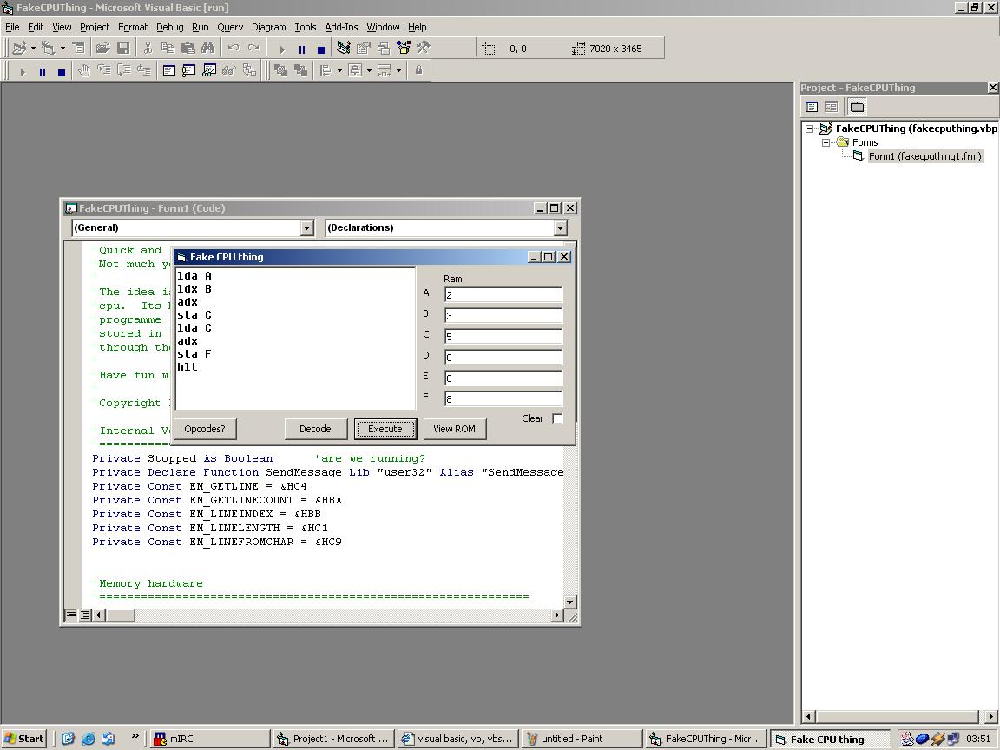



## Software 'CPU'

### Description

This is a small little app that simulates the lowest level of programming - i.e. directly manipulating the memory and registers etc.  It will take your assembly language code, convert it to machine code and then store it in the software ROM. When you want to execute the code it will fetch it from the software rom and then execute it with the software CPU. Its not wildly advanced or powerful, but its quite good fun and interesting if you like this kind of thing!
 
### More Info
 

             |
---                |---
**Submitted On**   |2003-01-10 22:58:04
**By**             |[Matt Dibb](https://github.com/Planet-Source-Code/PSCIndex/blob/master/ByAuthor/matt-dibb.md)
**Level**          |Intermediate
**User Rating**    |4.6 (32 globes from 7 users)
**Compatibility**  |VB 6\.0
**Category**       |[Miscellaneous](https://github.com/Planet-Source-Code/PSCIndex/blob/master/ByCategory/miscellaneous__1-1.md)
**World**          |[Visual Basic](https://github.com/Planet-Source-Code/PSCIndex/blob/master/ByWorld/visual-basic.md)
**Archive File**   |[Software\_'1527231102003\.zip](https://github.com/Planet-Source-Code/matt-dibb-software-cpu__1-42340/archive/master.zip)

